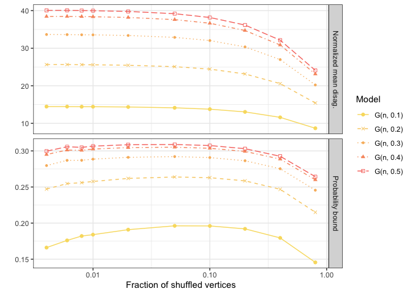
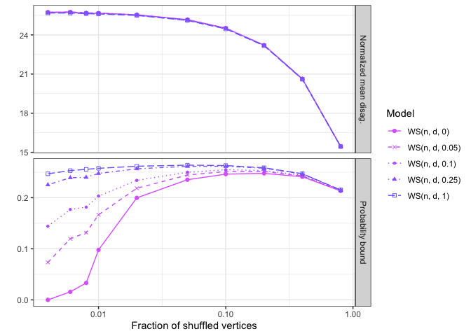
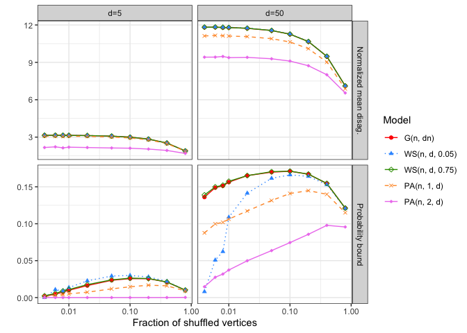
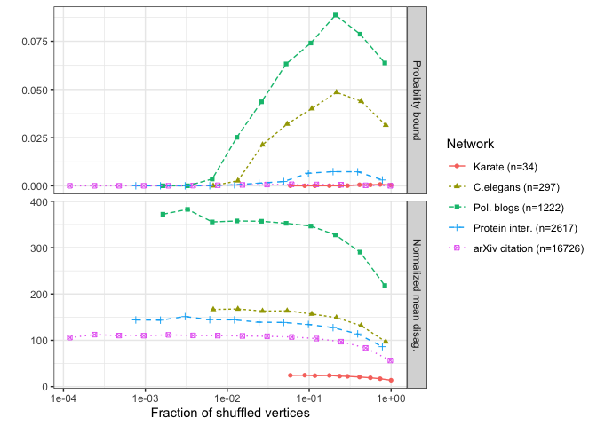
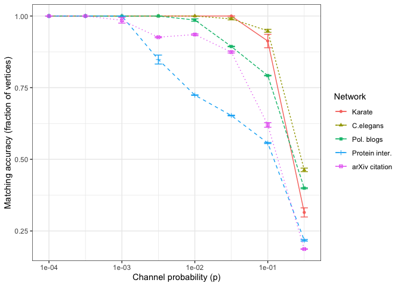
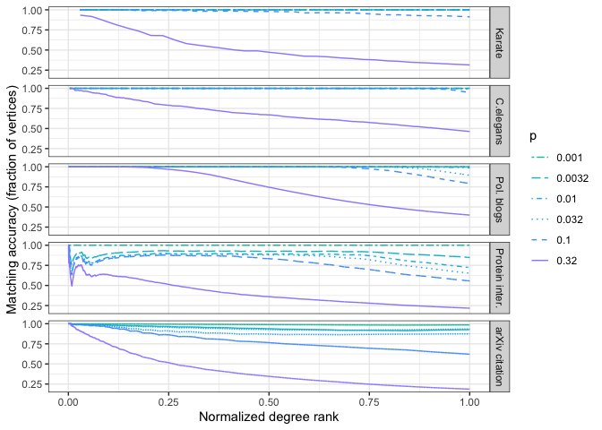

Readme
================
Daniel Sussman
5/13/2020

## GMMLE Package

A package for running simulations and creating plots found in [Maximum
Likelihood Estimation and Graph Matching in Errorfully Observed
Networks](https://arxiv.org/abs/1812.10519).

``` r
devtools::install_github("dpmcsuss/gmmle")
```

Load the
    library.

``` r
library(gmmle)
```

### Figure 1

Left:

``` r
make_er_plot()
```

<!-- -->

Right:

``` r
make_ws_plot()
```

<!-- -->

### Figure 2

``` r
make_model_compare_plot()
```

<!-- -->

### Figure 3

``` r
plot_prob_bound_norm_disag()
```

<!-- -->

### Figure 4

``` r
plot_matching_errors()
```

<!-- -->

### Figure 5

``` r
plot_cum_acc_by_norm_deg()
```

    ## Computing cumaltive errors for each match. This can take a few minutes

<!-- -->
